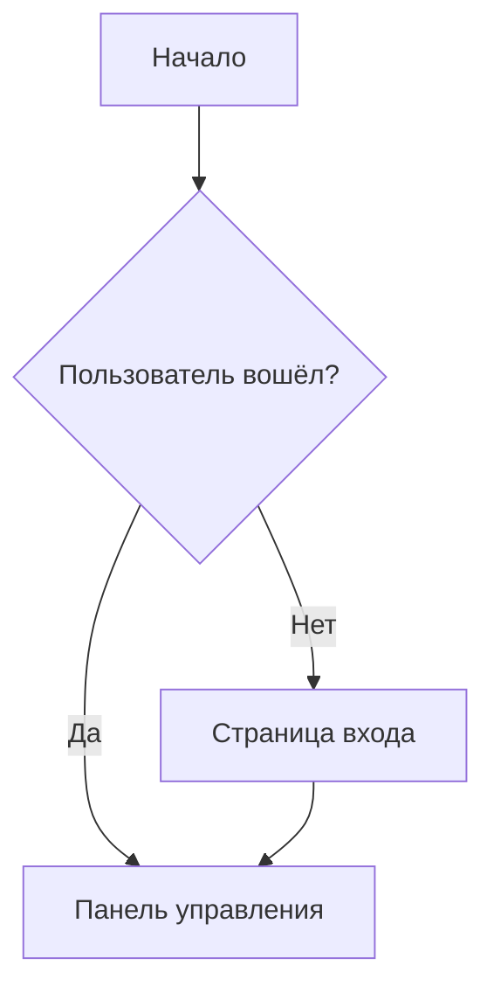

# Система панелей артефактов

Система рендеринга артефактов в стиле Claude для HTML, SVG и диаграмм Mermaid с элементами управления масштабированием/перемещением и UI в стиле глассморфизма.

## Возможности

- **Три типа артефактов**: HTML, SVG и диаграммы Mermaid
- **Масштабирование и перемещение**: Интерактивные элементы управления для SVG и Mermaid с поддержкой мыши/трекпада
- **Дизайн глассморфизма**: Соответствует теме ClaraVerse с акцентом rose pink (#e91e63)
- **Изменяемое разделение**: Перетаскиваемый разделитель для настройки соотношения чат/артефакт (сохраняется в localStorage)
- **Навигация по вкладкам**: Обработка нескольких артефактов в одном сообщении
- **Поддержка загрузки**: Экспорт артефактов как .html, .svg или .mermaid файлов
- **Изолированный HTML**: Саниризация DOMPurify с опциональным выполнением скриптов

## Использование

### Для интеграции с LLM

Артефакты **автоматически обнаруживаются** из стандартных markdown-блоков кода! Просто используйте обычные блоки кода:

**Стандартные markdown-блоки кода (автоматически обнаруживаются):**

````
```html
<!DOCTYPE html>
<html>
  <head><title>Вход</title></head>
  <body>...</body>
</html>
```
````

**Поддерживаемые языки:**

- ` ```html ` — Обнаруживает HTML-документы (должен включать `<!DOCTYPE`, `<html>` или `<body>`)
- ` ```svg ` — Обнаруживает SVG-графику (должен включать `<svg>`)
- ` ```mermaid ` — Обнаруживает диаграммы Mermaid (любое существенное содержание)

**Опциональные XML-теги (для явного управления):**

```
<artifact type="html" title="Страница входа">
<!DOCTYPE html>
<html>...</html>
</artifact>
```

### Типы артефактов

| Тип       | Расширение | Описание              | Возможности                        |
| --------- | ---------- | --------------------- | ---------------------------------- |
| `html`    | `.html`    | Веб-страницы с CSS/JS | Изолированный iframe               |
| `svg`     | `.svg`     | Векторная графика     | Масштаб, перемещение, автоподгонка |
| `mermaid` | `.mermaid` | Диаграммы и графики   | Масштаб, перемещение, тёмная тема  |

### Примеры

**HTML-артефакт (автоматически обнаруживается):**

````
```html
<!DOCTYPE html>
<html>
<head>
  <style>
    button { padding: 10px 20px; background: #e91e63; color: white; }
  </style>
</head>
<body>
  <button onclick="alert('Привет!')">Нажмите</button>
</body>
</html>
```
````

**SVG-артефакт (автоматически обнаруживается):**

````
```svg
<svg xmlns="http://www.w3.org/2000/svg" viewBox="0 0 200 200">
  <circle cx="100" cy="100" r="50" fill="#FFD700" />
  <text x="100" y="110" text-anchor="middle" fill="white">Привет</text>
</svg>
```
````

**Mermaid-артефакт (автоматически обнаруживается):**

````

````

## Архитектура

### Plug-and-Play система рендереров

Добавление новых типов артефактов требует только 3 шагов:

1. **Создайте рендерер** в `src/components/artifacts/renderers/NewRenderer.tsx`
2. **Добавьте тип** в объединение `ArtifactType` в `src/types/artifact.ts`
3. **Зарегистрируйте** в объекте `RENDERERS` в `src/components/artifacts/renderers/index.ts`

### Компоненты

```
src/components/artifacts/
├── ArtifactPane.tsx          # Главный контейнер с вкладками и заголовком
├── ZoomPanContainer.tsx      # Обёртка масштабирования/перемещения для визуального контента
└── renderers/
    ├── HTMLRenderer.tsx      # Изолированный HTML с DOMPurify
    ├── SVGRenderer.tsx       # SVG с валидацией
    ├── MermaidRenderer.tsx   # Рендеринг диаграмм Mermaid
    └── index.ts              # Реестр рендереров (plug-and-play)
```

### Управление состоянием

**Хранилище артефактов** (`src/store/useArtifactStore.ts`):

- `isOpen`: Видимость панели
- `artifacts`: Массив текущих артефактов
- `selectedIndex`: Индекс активной вкладки
- `splitRatio`: Процент разделения чат/артефакт (сохраняется)

### Парсинг

**Парсер артефактов** (`src/utils/artifactParser.ts`):

- `extractArtifacts(content)`: Парсит как XML, так и форматы блоков кода
- `hasArtifacts(content)`: Быстрая проверка маркеров артефактов
- Удаляет маркеры артефактов из содержимого сообщения для чистого отображения

## Интеграция

Артефакты автоматически обнаруживаются и рендерятся, когда:

1. Поток LLM завершён (событие `stream_end`)
2. Содержимое сообщения содержит маркеры артефактов
3. Парсер извлекает артефакты и открывает панель
4. Содержимое сообщения очищается (маркеры удалены)

См. `src/pages/Chat.tsx` строки 501-540 для кода интеграции.

## Настройка

### Тема Mermaid

Настройте в `src/components/artifacts/renderers/MermaidRenderer.tsx`:

```typescript
mermaid.initialize({
  theme: 'dark',
  themeVariables: {
    primaryColor: '#e91e63', // Акцент rose pink
    // ... дополнительная настройка
  },
});
```

### Безопасность HTML

Управляйте выполнением скриптов через пропс `allowScripts`:

```typescript
<HTMLRenderer content={content} allowScripts={false} />
```

Или установите переменную окружения:

```
VITE_ARTIFACT_ALLOW_SCRIPTS=false
```

### Соотношение разделения

По умолчанию: 60% чат, 40% артефакт. Ограничено 30-80% для панели чата.

Измените в `src/store/useArtifactStore.ts`:

```typescript
splitRatio: 60, // Измените по умолчанию здесь
```

## Будущие расширения

Легко добавить поддержку:

- **React компоненты**: Рендерер `react-live`
- **Графики**: Рендерер JSON-конфигурации Chart.js/Recharts
- **LaTeX**: Рендерер KaTeX для математических уравнений
- **3D модели**: Рендерер Three.js для файлов .gltf/.obj
- **Карты**: Рендерер Leaflet/Mapbox
- **Площадки кода**: Встраивание CodeSandbox/StackBlitz

## Зависимости

- `mermaid` — Рендеринг диаграмм
- `react-resizable-panels` — Разделённая раскладка
- `dompurify` — Саниризация HTML
- `react-zoom-pan-pinch` — Элементы управления масштабированием/перемещением

## Поддержка браузеров

- Современные браузеры с ES2020+
- Изолированные iframe (HTML-артефакты)
- Поддержка SVG
- Раскладка Flexbox

## Лицензия

Часть проекта ClaraVerse-Scarlet.
